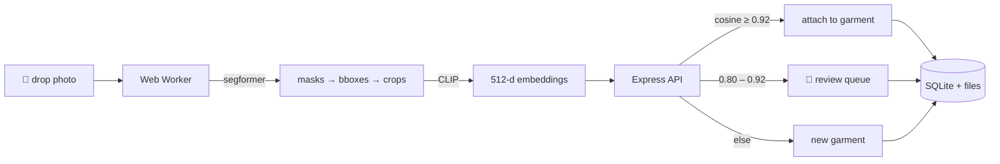

<div align="center">

# 🧥 wardrobe.io

### your closet, indexed.

Drop in hundreds of outfit photos. Watch them break apart into every shirt,
jean, and jacket you own — deduplicated into one beautiful, searchable wardrobe.


*demo video coming soon — drag-drop flood → wardrobe → drag-to-merge → stats*

</div>

---

## ✨ What it does

| | |
|---|---|
| 📸 **Drop anywhere** | The whole window is an uploader. Drag 300 photos onto it and go make chai. |
| 🧠 **In-browser ML** | A segmentation model ([`segformer_b2_clothes`](https://huggingface.co/mattmdjaga/segformer_b2_clothes)) finds every garment in a Web Worker. Your photos never leave your machine. |
| 🧬 **Auto-dedupe** | CLIP embeddings + cosine similarity recognize the same tee across photos: ≥0.92 auto-attaches, 0.80–0.92 asks you first. |
| 🫳 **Drag-to-merge** | Model called two identical shirts different? Drag one card onto the other. Every outfit re-points automatically. Undo included. |
| 👗 **Outfits view** | Original photos with piece chips — tap a chip, jump to the garment. |
| 📊 **Stats that screenshot well** | Most-worn, category breakdown, total wardrobe value, cost-per-wear. |
| 💾 **One-file backup** | Export the entire wardrobe (images + data) as a single zip. |
| 🎛 **Tunable matching** | Similarity thresholds live in Settings — make dedupe stricter or looser to taste. |

## 🏗 How it works



Three concepts: a **photo** is an outfit you wore; a **piece** is one detected
crop in a photo; a **garment** is the canonical item in your wardrobe. Merging
garments re-points pieces inside a transaction and logs the exact set moved —
so undo is exact, and outfit references never break.

## 🚀 Quickstart

```bash
# 1. backend  (http://localhost:3001)
cd server && npm install && npm run dev

# 2. frontend (http://localhost:5173, proxies to :3001)
cd client && npm install && npm run dev

# 3. drop photos onto the page. that's it.
```

First upload downloads the models (~130 MB, one time, cached by the browser).

<details>
<summary>🧪 Run the tests / e2e simulation</summary>

```bash
cd server && npm test          # 45 specs: merge/undo, dedupe thresholds, API
cd client && npm test          # 16 specs: queue, ML helpers, api client
node scripts/make-samples.mjs      # sample outfit photos
node scripts/simulate-client.mjs   # full ML→ingest→dedupe run in Node
```
</details>

## 🔩 Stack

**Client** — React 19 + Vite, hand-rolled CSS (no framework), [@huggingface/transformers](https://github.com/huggingface/transformers.js) in a module Web Worker, `idb-keyval` for the refresh-proof upload queue.
**Server** — Express + `better-sqlite3` (WAL, FK-enforced), `zod` validation, `multer` uploads, `archiver` backups. Photos live on your disk under `./data/`.

## 🗺 Roadmap

Accounts, cloud sync, share links, PWA — the productization path lives in
[SCOPE.md](SCOPE.md). Design history in [docs/](docs/).

## 🙏 Model credits

- [mattmdjaga/segformer_b2_clothes](https://huggingface.co/mattmdjaga/segformer_b2_clothes) (via Xenova ONNX port)
- [openai/CLIP ViT-B/32](https://huggingface.co/Xenova/clip-vit-base-patch32) (via Xenova ONNX port)

---

<div align="center">built with obsessive commit hygiene by <a href="https://github.com/arukurmi">@arukurmi</a></div>
